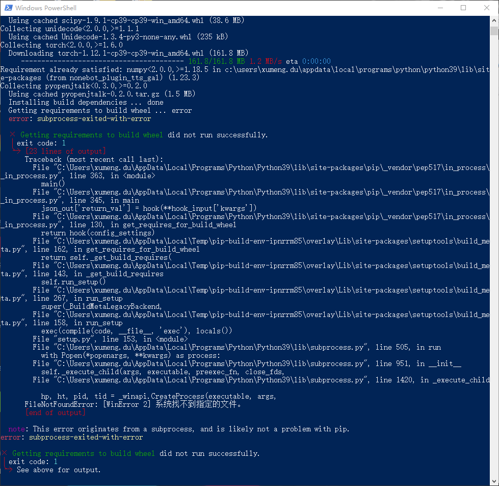
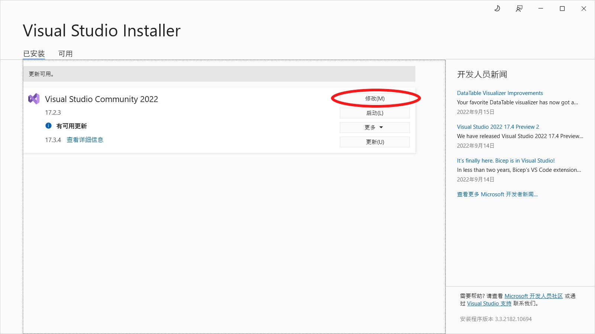
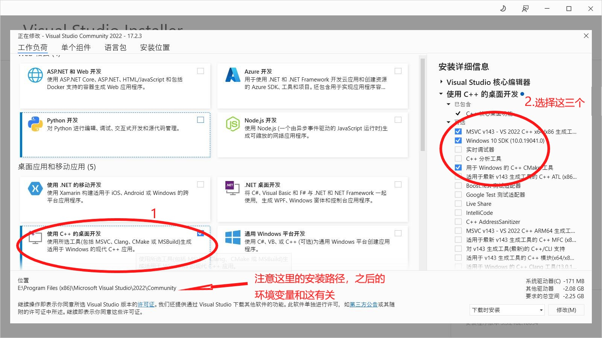
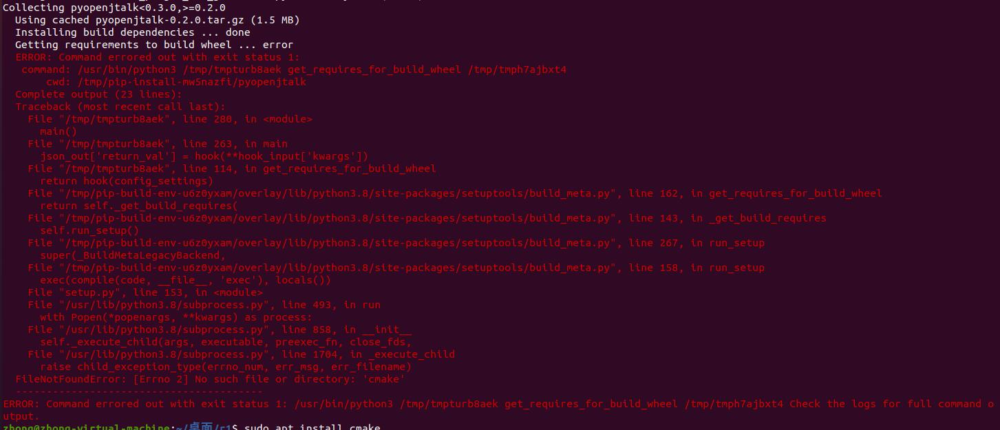

<p align="center">
  <a href="https://v2.nonebot.dev/"></a>
</p>

<div align="center">

# nonebot-plugin-tts-gal

_✨ [Nonebot2](https://github.com/nonebot/nonebot2) 基于nonebot2和vits的本地化角色语音合成插件 ✨_

<p align="center">
  <a href="https://github.com/dpm12345/nonebot_plugin_tts_gal/blob/master/LICENSE">
    
  </a>
  
  
  <a href="https://pypi.org/project/nonebot-plugin-tts-gal">
    
  </a>
</p>

</div>

# NOTE: 因学业繁忙, 现暂停维护

## 💬 前言

平时因为学业问题，有时可能会回复得比较慢，请见谅。

## 📖 介绍

vits的nonebot的本地化插件，使用已训练好的模型，按照配置要求，使机器人发送文本对应的语音

(**PS: 语音生成比较吃配置，生成过程花费时间可能会比较长，且大文本量会占用较大内存，过大会导致机器人进程 killed ，请留意**)

## 💿 安装

<details>
<summary>nb-cli安装</summary>
在 nonebot2 项目的根目录下打开命令行, 输入以下指令即可安装

    nb plugin install nonebot-plugin-tts-gal

</details>

<details>
<summary>pip安装</summary>

    pip install nonebot_plugin_tts_gal

</details>

## 🍰 资源文件

`data`文件夹中的`nonebot_plugin_tts_gal`会存储与插件有关的文件

可以安装完插件后运行一次自动建立再退出

也可以按照该页面的`data`文件夹进行手动建立

具体的资源下载示例请查看[例子示例](https://github.com/dpm12345/nonebot_plugin_tts_gal/blob/master/Usage.md#%E4%BE%8B%E5%AD%90%E7%A4%BA%E4%BE%8B)

## 💻 相关依赖

<details>
<summary>ffmpeg的安装</summary> 

**Windows**

在ffmpeg官网[下载](https://github.com/BtbN/FFmpeg-Builds/releases),选择对应的版本，下载后解压，并将位于`bin`目录添加到环境变量中

其他具体细节可自行搜索

**Linux**

Ubuntu下

```
apt-get install ffmpeg
```

或者下载源码安装(具体可搜索相关教程)

</details>

## ⚙️ 配置

| 配置项  | 必填 | 类型 | 默认值 |  说明  |
| :-----: | :--: | :----: | :----: | :-----: |
| tts_gal |  是  | Dict[Tuble[str],List[str]] | {():[""]} | 生成指定角色语音的关键配置，具体可见[tts_gal的配置要求](https://github.com/dpm12345/nonebot_plugin_tts_gal/blob/master/Usage.md#%E6%9C%BA%E5%99%A8%E4%BA%BA%E9%85%8D%E7%BD%AE%E6%96%87%E4%BB%B6%E8%A6%81%E6%B1%82) |
| auto_delete_voice | 否 | Bool | True | 是否自动删除生成语音，`True`为是，`False`为否 |
| decibel | 否 | int | -10 | 发送语音相对生成的分贝数<br>(原生成的音频音量可能比较大，因此通过此项来降低，负数为降，整数位升) |
| tts_gal_is_at | 否 | Bool | True | 使用该功能是否需要@机器人 |
| tts_gal_prefix | 否 | str | ""(空) | 使用该插件时的触发匹配前缀，减少冲突 |
| tts_gal_priority | 否 | int | 3 | 该插件的优先级大小 |
| tts_gal_tran_type | 否 | List[str] | ["youdao"] | 文本翻译使用项，默认为有道翻译("youdao")，可支持百度翻译("baidu")和腾讯翻译("tencent")，填写顺序为翻译调用优先级，若填写百度和腾讯翻译后需填写对应的配置项 |
| baidu_tran_appid | 否 | str | ""(空) | 百度翻译接口对应的appid，可在[百度翻译控制台](https://fanyi-api.baidu.com/manage/developer)获取 |
| baidu_tran_apikey | 否 | str | ""(空) | 百度翻译接口对应的apikey，可在[百度翻译控制台](https://fanyi-api.baidu.com/manage/developer)获取 |
| tencent_tran_region | 否 | str | "ap-shanghai" | 腾讯翻译接口对应的地域，可在[地域列表](https://cloud.tencent.com/document/api/551/15615#.E5.9C.B0.E5.9F.9F.E5.88.97.E8.A1.A8)获取 |
| tencent_tran_secretid | 否 | str | ""(空) | 腾讯翻译接口对应secretid，可在[云API密钥](https://console.cloud.tencent.com/capi)获取 |
| tencent_tran_secretkey | 否 | str | ""(空) | 腾讯翻译接口对应secretkey，可在[云API密钥](https://console.cloud.tencent.com/capi)获取 |
| tencent_tran_projectid | 否 | int | 0 | 腾讯翻译接口对应projectid，该项可以根据控制台-账号中心-项目管理中的配置填写，如无配置请填写默认项目ID:0或不填 |


## 🎉 使用

群聊和私聊仅有细微差别，其中下面语句中，`name`为合成语音的角色，`text`为转语音的文本内容(根据模型配置文件中的`language`会自动翻译为对应语言)，具体的相关功能解释可查看[这里](https://github.com/dpm12345/nonebot_plugin_tts_gal/blob/master/Usage.md#%E5%8A%9F%E8%83%BD%E8%A7%A3%E9%87%8A)

| 指令 | 可使用者 |  说明   |
| :---: | :----: | :-----: |
| [name]说[text]<br>或<br>[name]发送[text] | 所有人 | 生成语音，<br>若配置了`tts_gal_is_at`为`true`和`tts_gal_prefix`不为空，<br>那么分别要@机器人和在`name`前添加配置的前缀，<br>如设置前缀`tts`，那么使用时为 tts[name]说[text] |
| 禁用翻译 xxx | 超级用户(SUPERUSER) | 禁用名为xxx的翻译项，在启用前都不会使用xxx的翻译 |
| 启用翻译 xxx | 超级用户(SUPERUSER) | 启用名为xxx的翻译项，将会使用xxx的翻译(按原来配置设置的优先级) |
| 查看翻译 | 超级用户(SUPERUSER) | 查看插件目前调用的翻译项 |
| 查看禁用翻译 | 超级用户(SUPERUSER) | 查看插件目前禁用的翻译项 |

例如：
+ 宁宁说おはようございます.
+ 禁用翻译 baidu
+ 启用翻译 baidu
+ 查看翻译
+ 查看禁用翻译

## ✏️ 今后

添加更多的模型

添加更多的翻译选项


## ❔ Q&A

<details>
<summary>安装pyopenjtalk</summary> 

如果出现如下错误



可能由于缺少cmake和MSVC造成的，需要在本机安装

## Windows

### 第一步 安装Visual Studio

在Visual Studio的官网下载安装器,[VS2022点击此处下载](https://visualstudio.microsoft.com/zh-hans/free-developer-offers/)

下载社区版，即`Visual Studio Community`

### 第二步 下载相关工具

下载后点击，进入如图所示先点击修改，然后选择如图所示的项目





### 第三步 设置环境变量

下载好后，在安装目录中找到cmake和MSVC的bin目录

下面是参考目录,前面的目录即为之前强调的路径

```
E:\Program Files (x86)\Microsoft Visual Studio\2022\Community\Common7\IDE\CommonExtensions\Microsoft\CMake\CMake\bin

E:\Program Files (x86)\Microsoft Visual Studio\2022\Community\VC\Tools\MSVC\14.32.31326\bin\Hostx86\x64

```

将这两个目录添加到环境变量中

这样，windows安装pyopenjtalk的前置依赖便解决了

## Linux

Linux如出现以下情况



原因为缺少cmake工具，可以使用apt命令下载安装

```
sudo apt install cmake
```

安装好后便可安装pyopenjtalk
</details>

</details>

<details>
<summary>无法生成语音</summary> 

如果出现下载open_jtalk的错误信息，可以再次尝试，如果实在不行，可以使用`pip install openjtalk`

</details>

## 💡 鸣谢

+ 部分代码参考自[nonebot-plugin-petpet](https://github.com/noneplugin/nonebot-plugin-petpet)
+ **[CjangCjengh](https://github.com/CjangCjengh/)**：g2p转换，适用于日语调形标注的符号文件及分享的[柚子社多人模型](https://github.com/CjangCjengh/TTSModels)
+ **[luoyily](https://github.com/luoyily)**：分享的[ATRI模型](https://pan.baidu.com/s/1_vhOx50OE5R4bE02ZMe9GA?pwd=9jo4)

## 📝 更新日志

**2023.4.19 version 0.3.11：**

fix bug [#41](https://github.com/dpm12345/nonebot_plugin_tts_gal/issues/41)

**2023.4.18 version 0.3.10：**

修改部分代码

**2023.4.9 version 0.3.9：**

支持添加生成symbols的代码，以便添加更多的symbols,详见[Usage.md](https://github.com/dpm12345/nonebot_plugin_tts_gal/blob/master/Usage.md#%E5%85%B3%E4%BA%8Esymbols)

fix bug [#39](https://github.com/dpm12345/nonebot_plugin_tts_gal/issues/39)

**2023.1.12 version 0.3.8：**

修复regex的匹配问题

**2023.1.11 version 0.3.7：**

支持百度翻译和腾讯翻译的api使用，增加是否需要@机器人、自定义前缀、自定义插件priority等配置

**2022.12.9 version 0.3.3：**

自动读取已加载的角色模型，可通过[PicMenu插件](https://github.com/hamo-reid/nonebot_plugin_PicMenu)进行显示可使用的角色;对代码进行相关优化

**2022.10.27 version 0.3.2：**

修改正则表达式，避免文本出现"说/发送"而造成name的匹配错误

**2022.10.21 version 0.3.1：**

修复对配置项auto_delete_voice的判断bug

**2022.10.19 version 0.3.0：**

支持添加中文模型，优化相关代码，增添更多提示

**2022.10.7 version 0.2.3:**

适配nonebot2-rc1版本，并添加部分报错信息提醒

**2022.9.28 version 0.2.2:**

添加中文逗号替换成英文逗号

**version 0.2.1:**

将pyopenjtalk依赖更新为0.3.0，使python3.10也能使用

**2022.9.25 version 0.2.0:**

优化修改代码逻辑，支持自行添加vits模型，简单修复了一下有道翻译的翻译问题，启动时自动检测所需文件是否缺失

**2022.9.21 version 0.1.1:**

修改依赖

