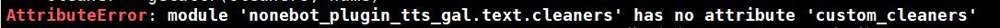

<p align="center">
  <a href="https://v2.nonebot.dev/"></a>
</p>

<div align="center">

# nonebot_plugin_tts_gal

基于nonebot和vits的部分gal角色的语音合成插件

</div>

# 旧版本用户注意

在0.3.0版本再次对代码进行了更改，支持添加部分中文VITS模型，也许可能会报错下面的关键错误，具体解决方案可以看可以查看[Usage.md](https://github.com/dpm12345/nonebot_plugin_tts_gal/blob/master/Usage.md)




# 前言

本人python比较菜，因此可能有些地方写的比较屎，还望轻喷

# 安装之前

<details>
<summary>关于安装pyopenjtalk的问题</summary> 


如果先前已经安装了pyopenjtalk，该内容可以直接忽略

可能由于缺少cmake和MSVC造成的，需要在本机安装

如果你不清楚自己有没有，可以先尝试安装，如果出现了以上报错，可以再回来阅读一下解决方案

## Windows

### 第一步 安装Visual Studio

在Visual Studio的官网下载安装器,[VS2022点击此处下载](https://visualstudio.microsoft.com/zh-hans/thank-you-downloading-visual-studio/?sku=Community&channel=Release&version=VS2022&source=VSLandingPage&cid=2030&passive=false)

### 第二步 下载相关工具

下载后点击，进入如图所示先点击修改，然后选择如图所示的项目


### 第三步 设置环境变量

下载好后，在安装目录中找到cmake和MSVC的bin目录

下面是参考目录,前面的目录即为之前强调的路径

```
E:\Program Files (x86)\Microsoft Visual Studio\2022\Community\Common7\IDE\CommonExtensions\Microsoft\CMake\CMake\bin

E:\Program Files (x86)\Microsoft Visual Studio\2022\Community\VC\Tools\MSVC\14.32.31326\bin\Hostx86\x64

```

将这两个目录添加到环境变量中

这样，windows安装pyopenjtalk的前置依赖便解决了

## Linux

Linux如出现以下情况


原因为缺少cmake工具，可以使用apt命令下载安装

```
sudo apt install cmake
```

安装好后便可安装pyopenjtalk
</details>

# 安装

pip安装

```
pip install nonebot_plugin_tts_gal
```

nb-cli安装

```
nb plugin install nonebot-plugin-tts-gal
```


## 资源文件

`data`文件夹中的`nonebot_plugin_tts_gal`会存储与插件有关的文件

可以安装完插件后运行一次自动建立再退出

也可以按照该页面的`data`文件夹进行手动建立

具体的资源下载示例请查看[Usage.md](https://github.com/dpm12345/nonebot_plugin_tts_gal/blob/master/Usage.md)

## 相关依赖

<details>
<summary>ffmpeg的安装</summary> 


**Windows**

在ffmpeg官网[下载](https://github.com/BtbN/FFmpeg-Builds/releases),选择对应的版本，下载后解压，并将位于`bin`目录添加到环境变量中

其他具体细节可自行搜索

**Linux**

Ubuntu下

```
apt-get install ffmpeg
```

或者下载源码安装(具体可搜索相关教程)

</details>

# 配置项

<details>
<summary>auto_delete_voice</summary> 
该值的默认值为`true`,用于是否自动删除生成的语音文件

请在使用的配置文件(.env.*)加入

```
auto_delete_voice = true
```

如不想删除，可改为

```
auto_delete_voice = false
```

</details>

<details>
<summary>tts_gal</summary> 


该配置项采用python的字典，其中键为元组，值为列表，具体代表含义及设置可以查看[Usage.md](https://github.com/dpm12345/nonebot_plugin_tts_gal/blob/master/Usage.md)

</details>

# 使用

群聊和私聊仅有细微差别，其中下面语句中，`name`为合成语音的角色，`text`为转语音的文本内容(根据配置文件中的`lang`会自动翻译为对应语言)

## 群聊

`@机器人 [name]说[text]`

## 私聊

`[name]说[text]`

例如：宁宁说おはようございます.

**关于此方面自定义问题的可以查看**[Usage.md](https://github.com/dpm12345/nonebot_plugin_tts_gal/blob/master/Usage.md)

# 今后

添加更多的模型

添加更多的翻译选项


# Q&A

<details>
<summary>安装pyopenjtalk</summary> 

如果出现如下错误


请参考上面的安装之前的说明

</details>

<details>
<summary>无法生成语音</summary> 

如果出现下载open_jtalk的错误信息，可以再次尝试，如果实在不行，可以使用`pip install openjtalk`

</details>

# 感谢

+ 部分代码参考自[nonebot-plugin-petpet](https://github.com/noneplugin/nonebot-plugin-petpet)
+ **[CjangCjengh](https://github.com/CjangCjengh/)**：g2p转换，适用于日语调形标注的符号文件及分享的[柚子社多人模型](https://github.com/CjangCjengh/TTSModels)
+ **[luoyily](https://github.com/luoyily)**：分享的[ATRI模型](https://pan.baidu.com/s/1_vhOx50OE5R4bE02ZMe9GA?pwd=9jo4)

# 更新日志

**2022.10.19 version 0.3.0：**

支持添加中文模型，优化相关代码，增添更多提示

**2022.10.7 version 0.2.3:**

适配nonebot2-rc1版本，并添加部分报错信息提醒

**2022.9.28 version 0.2.2:**

添加中文逗号替换成英文逗号

**version 0.2.1:**

将pyopenjtalk依赖更新为0.3.0，使python3.10也能使用

**2022.9.25 version 0.2.0:**

优化修改代码逻辑，支持自行添加vits模型，简单修复了一下有道翻译的翻译问题，启动时自动检测所需文件是否缺失

**2022.9.21 version 0.1.1:**

修改依赖

